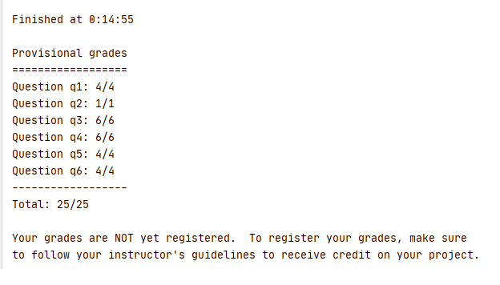

# INT3401-8
Trí tuệ nhân tạo - Bài tập
# **CLASSFICATION**

## Kết quả chạy autograder.py

## Q1 : Perceptron
` python dataClassifier.py -c perceptron `
## Q2 : Perceptron Analysis
`python dataClassifier.py -c perceptron -w  `
## Q3 : MIRA
`python dataClassifier.py -c mira --autotune `
## Q4 : Digit Feature Design
`python dataClassifier.py -d digits -c naiveBayes -f -a -t 1000  `
* Features gồm các thành phần:
  * Số lần gấp khúc (đổi hướng từ theo chiều dọc thành chiều ngang hoặc ngược lại).
  * Tỉ lệ của ảnh (lấy chiều rộng chia cho chiều dài)
  * Số pixel không có giá trị 0
  * Số pixel không phải có giá trị 0 ở phía bên trên tấm hình
  * Số pixel không phải có giá trị 0 ở phía bên phải tấm hình

## Q5 : Behavioral Cloning
`python dataClassifier.py -c perceptron -d pacman`
1. Lặp lại max_iterations lần.
2. Lặp lại số lần bằng độ dài trainingDatamax_iterations.
3. Lấy từng cặp data vàd đáp án từ trainingData, trainingLabels.
4. Với mỗi label trong phần tử thứ 2 trong data lấy ra từng cặp feature, value.
5. Nếu label đúng thì trọng số của feature được tăng 1 lượng value nếu sai thì sẽ giảm đi đúng lượng đó.

## Q6 ; Pacman Feature Design
`python dataClassifier.py -c perceptron -d pacman -f -g ContestAgent -t 1000 -s 1000`
* Features gồm các thành phần:
  * STOP: bằng 0 nếu action là dừng không sẽ là 0.01
  * nearest_ghost: khoảng cách mahattan đến ghost gần nhất
  * các thành phần (ghost, i) với i trong khoảng từ 0 đến số ma hiện có: 5 chia cho tổng 0.1 với khoảng cách mahattan đến ghost
  * các thành phần (capsule, i) với i trong khoảng từ 0 đến số capsule hiện có: 15 chia cho tổng 1 với khoảng cách mahattan đến capsule
  * các thành phần (food, i) với i trong khoảng từ 0 đến số thức ăn hiện có:
  * capsule_count: Số capsules nhân với 10
  * win: bằng 1 nếu thua ngược lại sẽ là 0
  * lose: bằng 1 nếu thua ngược lại sẽ là 0
  * score: số điểm nhân với 10
